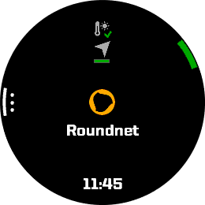
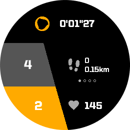

# 
        Roundnet Activity   

Roundnet activity tracker for Garmin smartwatches. Allows you to keep score so that you don't forget game progress even after an epic rally. Comes with customizable data records and fields, plus an alarm to remind you to switch sides every X rounds.

## Features
- records score, heartrate, calories, steps, distance and temperature
- customizable dynamic datafield
- shows up as roundnet activity in Garmin Connect
- custom datafields per point and per game in activity summary / details
- alarm to rotate starting positions every X rounds
- service position helper with a diagram
- 3s service timer with observer mode
- break timers

Check the [settings](#settings) and [activity](#activity) section below to learn how to use the app

## Planned features
- break timers
    * 1 minute timeout
    * 3 minute set-break
    * 5 minute injury break
- custom activity summary

## Screenshots

## Installation
The app is available on the [Garmin Connect IQ Store](https://apps.garmin.com/apps/25832203-f7ed-40a7-977d-0a9172b68ee4).

You can also build it from source for your specific device with the VSCode extension. This process is described [here](https://developer.garmin.com/connect-iq/connect-iq-basics/getting-started/) and [here](https://developer.garmin.com/connect-iq/connect-iq-basics/your-first-app/#ariaid-title7).

## Getting started
When starting the app, you get a menu similar to Garmin's native activity starting screen. Pressing the start button will start the activity, pressing the "menu" button will open the settings (on touchscreen devices, it's usually a long press or a down swipe).

### Settings
The app allows you to customize a *few* things:

- Sensors -- enable sensors for the activity recording
    * Toggle location (GPS)
    * Toggle temperature

- Datafield -- settings for the dynamic datafield
    - Fields -- enable or disable distance, calories, score, daytime, temperature and service position datafields
        * Service position
            + shows a small diagram representing both teams around the spike; the bottom circle would be you and the empty circle is the player who should serve for the next point.
        * Show player tags
            + adds letter tags in the circles to identify players; if disabled, the setting `Òbserver mode` will not have an effect on the service position diagram.

    - Scrolling -- define dynamic field scrolling behavior
        * Toggle Auto Scroll
            + enables the datafield to automatically skip to the next data regularly
        * Set auto scroll speed
            + very fast: 1s, fast: 3s, normal: 5s, slow: 7s, very slow: 11s ; defaults to normal
        * Toggle Swipe Scroll
            + allows the dynamic field to be scrolled using a left or right swipe on touchscreen devices.

- Game Settings -- settings for score based app-behaviour
    * Toggle auto win / loose
        + enables the app to automatically ends a game when the target score is reached by one of the two teams.
    * Toggle two points difference
        + checks if a team is 2 points ahead of its opponents to win
    * Set points to win game
        + set the target score to a number between 5 and 51, defaults to 21
    * Toggle rotate start positions alarm
        + enables an alarm reminding you to rotate starting positions every X points
    * Set points to rotate
        + set the number of points to play between each start position rotation, between 3 and 10, defaults to 5

* Observer mode
    + enables 3s service timer and yellow team letter tags on service position helper

* Set double click speed
    + very fast: 160ms, fast: 240ms, normal: 320ms, slow: 400ms, very slow: 560ms 

### Activity

On the activity view, you have the timer, the score, the dynamic field and the heartrate field. Pressing the up button will increase your opponent's score in grey and pressing the down button will increase yours in yellow. If enabled in the settings, swipping left or right on touchscreen devices will skip to the next or previous data in the dynamic field. Pressing the lap button will save the game state to the activity file and start a new one. Press the start button to stop the activity and save or discard it.

When observer mode is enabled, pressing the lap button once will silently start a 3s service timer. The watch will vibrate on timeout to alarm the user. To start a new set/game, double click the lap button.

You can start break timers and change settings from the activity by pressing the menu button on your watch.

## Changelog

### v0.13
- add timers for timeouts, breaks and injuries
- add activity menu to pause the activity and start a timer or change settings during game
- update icons

### v0.12
- add setting option to disable player tags on service position helper
- add observer mode
    * 3s service timer when pressing lap button
    * player tags for yellow team

### v0.11:
- add letters on service helper for opponents
- various bug fixes

### v0.10:
- add service position helper
- add equal service system for helper and rotate position alarm

### v0.9:
- add a font that scale with every display size
- fix various issues

### v0.8:
- fix adding game won/lost on draw
- fix mean time and distance per point data

### v0.7:
- fix crash on older devices and on watches that can't vibrate or play a sound
- performance fixes

### v0.6:
- fix menu labels overflow
- fix battery drain
- handle session not starting

### v0.5:
- add configurable rotate starting positons alarm
- add configurable auto win/loose

### v0.4:
- add configurable double click speed, datafield auto scrolling, swipe scrolling and scrolling speed
- fix crash on physical vivoactive3 when restarting a new game

### v0.3:
- add confirmation screen when restarting a new game
- add dynamic field interaction on swipe for touchscreen devices
- add vibrating feedback on input
- enable decrementing score with double press
- fix touchscreen behaviour for venu and vivoactive series

### v0.2:
- improve ui behaviour for touchscreen devices
- fix game (lap) stats not showing up in Garmin Connect
- remove compatibility for 2-color screen devices

### v0.1
- first version of the app
